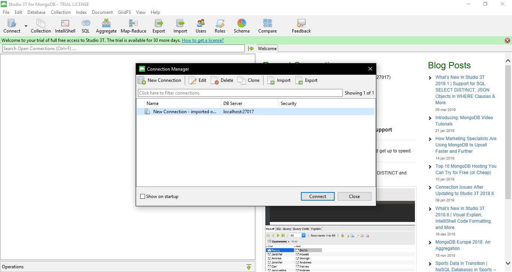

<strong><h2>COMO IMPORTAR BANCO MongoDB</h2></strong>
<strong>Através do Studio 3T</strong>
  - Inicie o MongoDB
  - Inicie o Software Studio 3T
  - Conecte o software ao servidor local do MongoDB
  
  - Na Aba `Database` clique em `Import Colletions`
  
  - Na janela que abrir, selecione a opção `JSON` e clique `Next`
  
  - Clique no `+` na parte superior a esquerda
  
  - Selecione todas os arquivos.json presente na pasta "Banco" presente dentro da pasta do projeto e clique em `Abrir`
  
  - Agora clique `Next`
  
  - Veja como irá fica o banco e clique `Next`
  
  - Agora clique em `Start Import`
  
  - Disfrute do banco
 

<strong>Através de Linhas de Comandos</strong>
  - Abra seu shell
  - Inicie o MongoDB
  - Execute o seguinte comando no shell para cada uma das colletions e seus respectivos arquivos.json presentes na pasta Banco 
    - `mongoimport -d nome_do_banco -c nome_da_colletion --file caminho/para/o_arquivo/colletion.json`
  - Exemplos:
    - `mongoimport -d odontonetworkapi -c cargos --file C:\Users\IFCE\Documents\OdontoNetwork\Banco\cargos.json`
    - `mongoimport -d odontonetworkapi -c funcionarios --file C:\Users\IFCE\Documents\OdontoNetwork\Banco\funcionarios.json`
    - `mongoimport -d odontonetworkapi -c grupos --file C:\Users\IFCE\Documents\OdontoNetwork\Banco\grupos.json`
