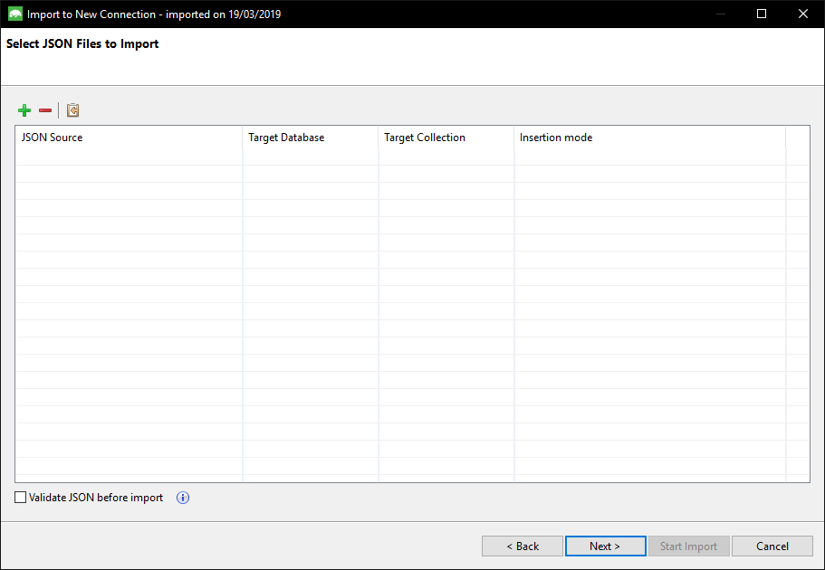
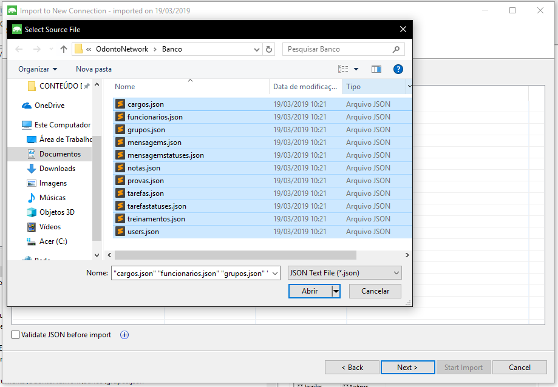
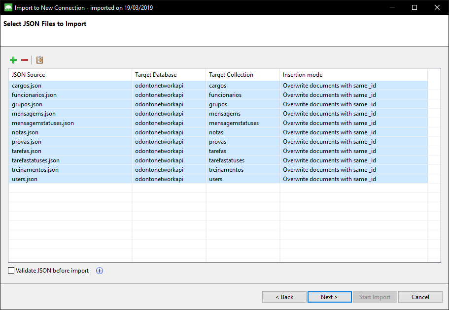

<strong><h2>COMO IMPORTAR BANCO MongoDB</h2></strong>
- <strong>Através do Studio 3T</strong>
  - Inicie o MongoDB
  - Inicie o Software Studio 3T
  - Conecte o software ao servidor local do MongoDB
  
  - Na Aba Database clique em Import Colletions
  
  - Na janela que abrir, selecione a opção JSON e clique Next
  
  - Clique no "+" na parte superior a esquerda
  
  - Selecione todas os arquivos.json presente na pasta "Banco" presente dentro da pasta do projeto
  
  - Agora clique Next
  
  - Veja como irá fica o banco e clique Next
  
  - Agora clique em Start Import
  
- <strong>Através de Comandos</strong>

